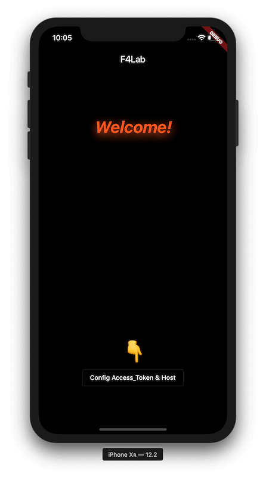
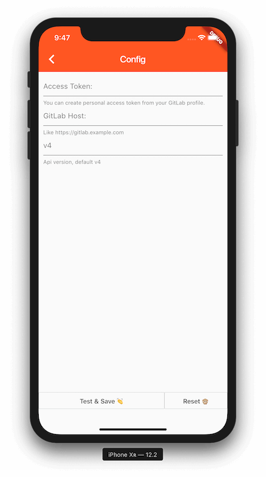
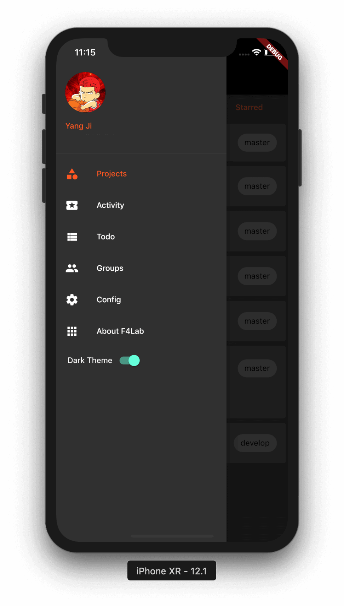
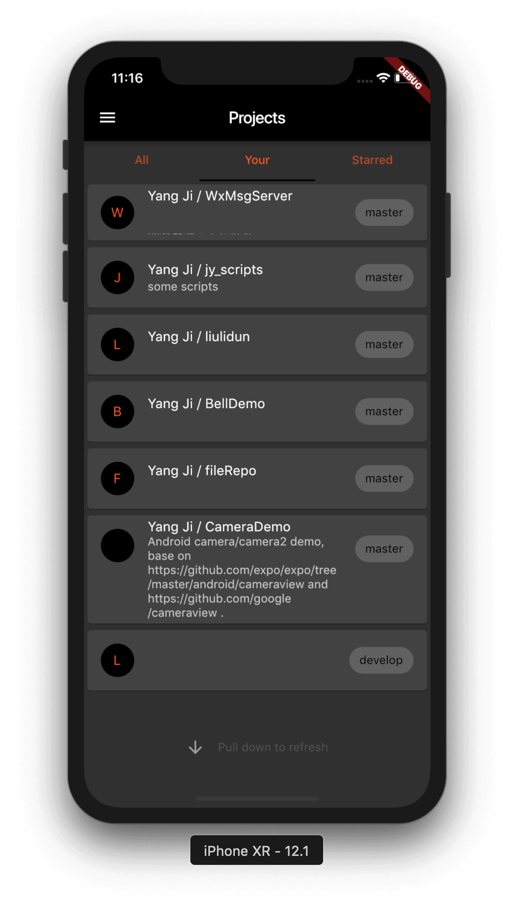
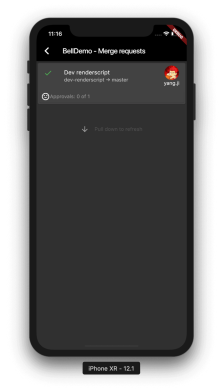
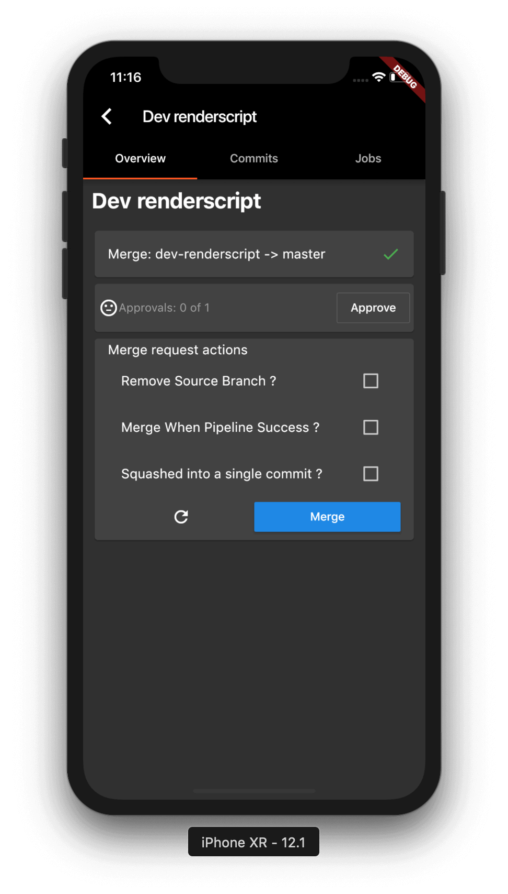
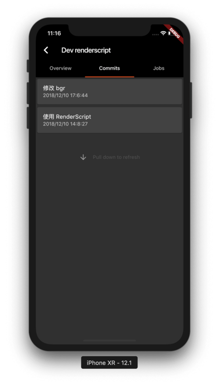
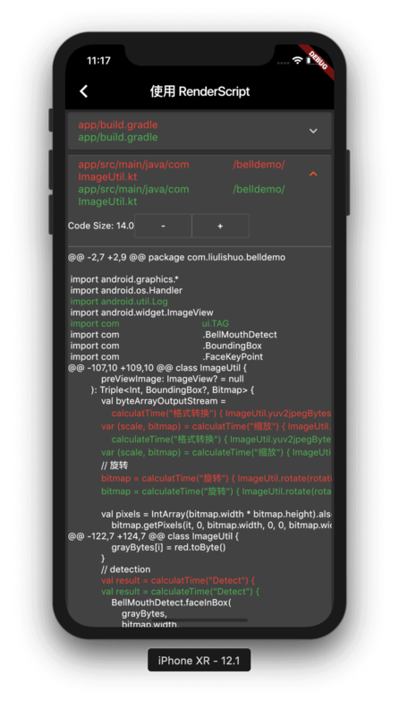

<!--  -->

# F4Lab

*A glitlab client made by flutter. Support Android & IOS.*

|home|config|nav|project|merge requests| merge request|commit|diff|
|:-:|:-:|:-:|:-:|:-:|:-:|:-:|:-:|
|| |  |  |  |  |  |  |

## Usage

### Running in Android device

1. [Download release apk](https://github.com/stefanJi/Flutter4GitLab/releases)
2. Install apk and then run

### Running in IOS device

1. Follow [Dev](#Dev) Section

## Dev

> First, you shuold setup your Flutter development env. [Set up an editor](https://flutter.io/docs/get-started/editor).

### Run Project

1. `fork` or `clone` this project
2. In project root dir, run:
    - `flutter packages pub get`
    - `flutter run`

---

Features: welcome to contribute for the following features

- **App**
  - [x] Login by Personal Access Token
  - [x] Projects
  - [x] Themes mode
  - [ ] Markdown and code highlighting support
  - [ ] Search Users/Orgs, Repos, Issues/MRs & Code.
- **Repositories**
  - [ ] Search Repos
  - [ ] Browse and search Repos
  - [x] See your public, private and forked Repos
  - [ ] Filter Branches and Commits
- **Issues and Merge Requests**
  - [x] Commit code diff
  - [x] Run pipeline jobs
  - [x] Rebase when merge request
  - [x] Merge MRs
  - [x] MRs statuses
  - [x] Approve or UnApprove MR
  - [x] CI Status
  - [x] Play|Cancel|Retry CI Job
  - [x] Filter Merge Requests State. (opened, closed, locked, merged)
  - [x] Filter Merge Requests Assign. (all, assigned_to_me)
  - [x] Discussion of merge request
- **Organisations**
    - [x] Feeds
    - [x] Repos
- **PipeLines**
    - [x] List project's pipepine
    - [x] Play, Retry, Cancel Pipeline Job

Api: GitLab Server || Local Server

- [**GitLab Api Doc**](https://gitlab.com/help/api/README.md)
- Or Your personal GitLab.(Eg: https://gitlab.exsample.com/help/api/README.md)

Dependencies: Lib && Plugin 

- Android Minimum **SDK 16**, IOS Minimun **9.0**
- [**Flutter**](https://github.com/flutter/flutter)
- [**shared_preferences**](https://pub.dartlang.org/packages/shared_preferences)
- [**pull_to_refresh**](https://pub.dartlang.org/packages/pull_to_refresh)
- [**xml**](https://pub.dartlang.org/packages/xml)
- [**url_launcher**](https://pub.dartlang.org/packages/url_launcher)
- [**sentry**](https://pub.dartlang.org/packages/sentry)
- [**flutter_stetho**](https://pub.dartlang.org/packages/flutter_stetho)
- [**Dio**](https://github.com/flutterchina/dio)
- [**Provider**](https://github.com/rrousselGit/provider)

## Contribution

Please **contribute** to the  project either by **_creating a PR_** or **_submitting an issue_** on GitHub.

## License

> Copyright (C) 2018 StefanJi.
> (See the [LICENSE](./LICENSE) file for the whole license text.)
