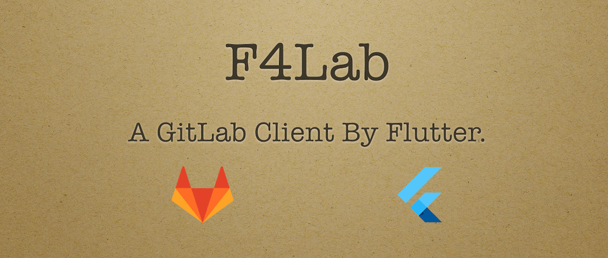
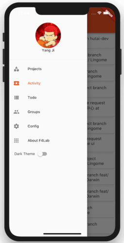
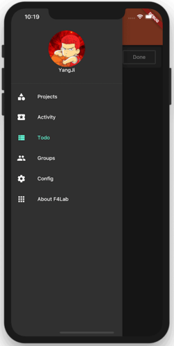
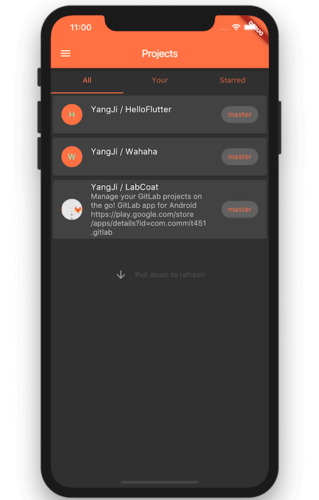
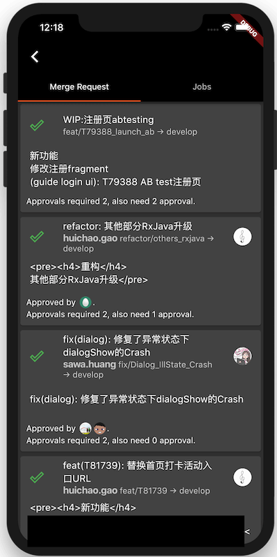

# F4Lab

> Flutter for GitLab. Support **Android** & **IOS**.

[Download APK.](./art/app-release.apk)

Yet another **open-source** GitLab client app but unlike any other app, F4Lab is building by Flutter.  

### Welcome to contribute to the following features.

## Features  
- **App**
  - [x] Login by Personal Access Token
  - [x] Projects
  - [x] Themes mode
  - [ ] Markdown and code highlighting support
  - [ ] Search Users/Orgs, Repos, Issues/MRs & Code.
- **Repositories**
  - [ ] Edit, Create & Delete files (commit)
  - [ ] Edit, Create & Delete files (Project Columns Cards)
  - [ ] Search Repos
  - [ ] Browse and search Repos
  - [x] See your public, private and forked Repos
  - [ ] Filter Branches and Commits
- **Issues and Pull Requests**
  - [ ] Search Issues/MRs
  - [ ] Filter Issues/MRs
  - [ ] Open/close Issues/MRs
  - [ ] Comment on Issues/MRs
  - [ ] Manage Issue/PR comments
  - [ ] Edit Issues/MRs
  - [ ] Assign people and add Labels and Milestones to Issues/MRs
  - [ ] Merge MRs
  - [ ] MRs request review changes/approve & comment.
  - [x] MRs statuses
  - [ ] Approve MR
- **Organisations**
    - [x] Feeds
    - [x] Repos

## GitLab Api

- [**GitLab Api Doc**](https://gitlab.com/help/api/README.md)
- Or Your personal GitLab.(https://gitlab.exsample.com/help/api/README.md)

## Specs / Open-source libraries:

- Android Minimum **SDK 16**, IOS Minimun **9.0**
- [**Flutter**](https://github.com/flutter/flutter)
- [**shared_preferences**](https://pub.dartlang.org/packages/shared_preferences)
- [**pull_to_refresh**](https://pub.dartlang.org/packages/pull_to_refresh)
- [**xml**](https://pub.dartlang.org/packages/xml)
- [**url_launcher**](https://pub.dartlang.org/packages/url_launcher)

## Contribution

Please **contribute** to the  project either by **_creating a PR_** or **_submitting an issue_** on GitHub.  

## License

> Copyright (C) 2018 StefanJi.  
> (See the [LICENSE](./LICENSE) file for the whole license text.)

## Screenshots

| Light | Dark |
|:-:|:-:|
|  |  |

| Repo | Merge Request |
|:-:|:-:|
|  |  |
