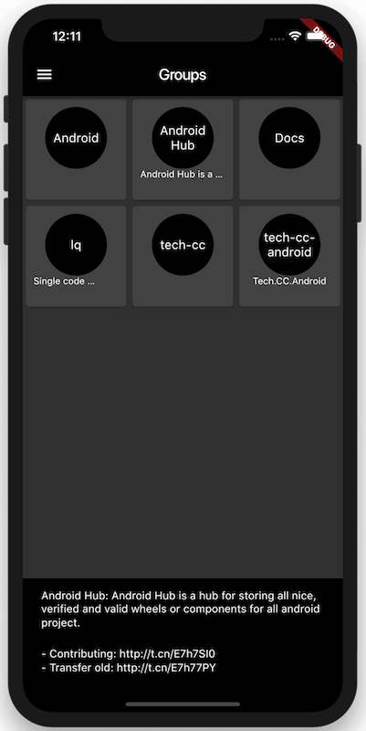

# F4Lab

> Flutter for GitLab. Support **Android** & **IOS**.


### Run Project

Please referer to [Set up an editor](https://flutter.io/docs/get-started/editor).

---

Yet another **open-source** GitLab client app but unlike any other app, F4Lab is building by Flutter.  

### Welcome to contribute to the following features.

## Features  
- **App**
  - [x] Login by Personal Access Token
  - [x] Projects
  - [x] Themes mode
  - [ ] Markdown and code highlighting support
  - [ ] Search Users/Orgs, Repos, Issues/MRs & Code.
- **Repositories**
  - [ ] Edit, Create & Delete files (commit)
  - [ ] Edit, Create & Delete files (Project Columns Cards)
  - [ ] Search Repos
  - [ ] Browse and search Repos
  - [x] See your public, private and forked Repos
  - [ ] Filter Branches and Commits
- **Issues and Pull Requests**
  - [ ] Search Issues/MRs
  - [ ] Filter Issues/MRs
  - [ ] Open/close Issues/MRs
  - [ ] Comment on Issues/MRs
  - [ ] Manage Issue/PR comments
  - [ ] Edit Issues/MRs
  - [ ] Assign people and add Labels and Milestones to Issues/MRs
  - [ ] Merge MRs
  - [ ] MRs request review changes/approve & comment.
  - [x] MRs statuses
  - [x] Approve or UnApprove MR
  - [x] CI Status
  - [x] Play|Cancel|Retry CI Job
- **Organisations**
    - [x] Feeds
    - [x] Repos
- **PipeLines**
    - [x] List project's pipepine
    - [x] Play, Retry, Cancel Pipeline Job

## GitLab Api

- [**GitLab Api Doc**](https://gitlab.com/help/api/README.md)
- Or Your personal GitLab.(https://gitlab.exsample.com/help/api/README.md)

## Specs / Open-source libraries:

- Android Minimum **SDK 16**, IOS Minimun **9.0**
- [**Flutter**](https://github.com/flutter/flutter)
- [**shared_preferences**](https://pub.dartlang.org/packages/shared_preferences)
- [**pull_to_refresh**](https://pub.dartlang.org/packages/pull_to_refresh)
- [**xml**](https://pub.dartlang.org/packages/xml)
- [**url_launcher**](https://pub.dartlang.org/packages/url_launcher)

## Contribution

Please **contribute** to the  project either by **_creating a PR_** or **_submitting an issue_** on GitHub.  

## Comm Widget

### GitLab Client

Wrapped api request.

- setup token and host
- request headers
- generate full url

#### Usage

```dart
GitlabClient _client = GitlabClient.newInstance();
final url = "";
final remoteData = await _client
        .get(url)
        .then((resp) {
          page = int.tryParse(resp.headers['x-page'] ?? 0);
          total = int.tryParse(resp.headers['x-total-pages'] ?? 0);
          next = int.tryParse(resp.headers['x-next-page'] ?? 0);
          return resp;
        })
        .then((resp) => utf8.decode(resp.bodyBytes))
        .then((s) => jsonDecode(s))
        .catchError((err) {
          print("loadData err: $err");
          return [];
        })
        .whenComplete(_client.close);
    return remoteData;
/// remoteData: Object or List
```

### CommListView

It is a common component that contains some logics. as follows:

- Automatically load data
- Pull down to refresh
- Pull up page load

```dart
///[canPullUp] This bool will affect whether or not to have the function of drop-up load
///[canPullDown] This bool will affect whether or not to have the function of drop-down refresh
///[withPage] Tihs bool will affect whether or not to add page arg to request url
abstract class CommListWidget extends StatefulWidget {
  final bool canPullUp;

  final bool canPullDown;

  final bool withPage;

  CommListWidget(
      {this.canPullDown = true, this.canPullUp = true, this.withPage = true});
}
```

#### Usage

```dart
/// Create a list statefull widget

class ProjectTab extends CommListWidget {
  final String type;

  ProjectTab(this.type);

  @override
  State<StatefulWidget> createState() => ProjectState(
      "projects?order_by=updated_at&per_page=10&simple=true&$type");
}

/// Create a state for list

class ProjectState extends CommListState {
  ProjectState(String endPoint) : super(endPoint);

  @override
  Widget childBuild(BuildContext context, int index) {
    final item = data[index];
    return Card(...);
  }
}

```

## License

> Copyright (C) 2018 StefanJi.  
> (See the [LICENSE](./LICENSE) file for the whole license text.)

## Screenshots

| Light | Dark |
|:-:|:-:|
|  |  |

| Repo | Merge Request |
|:-:|:-:|
|  |  |

|Groups|Jobs|
|:-:|:-:|
|||
